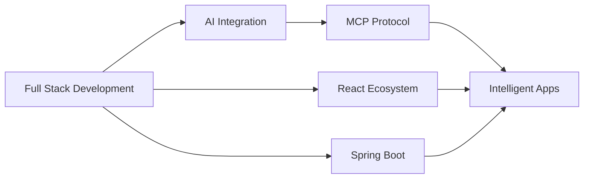

<div align="center">
  
# 👨‍💻 UDIPTA DAS

### Full Stack Developer | AI Enthusiast | Open Source Contributor

[](https://git.io/typing-svg)


</div>

---

## 🚀 About Me

```typescript
const udipta = {
  location: "India 🇮🇳",
  currentFocus: ["Spring Boot", "Angular", "React", "FastAPI", "Generative AI"],
  learning: ["MCP (Model Context Protocol)", "AI Integration", "Microservices"],
  interests: ["Full Stack Development", "AI/ML", "Cloud Architecture"],
  funFact: "Sport loving coder who debugs while dreaming ⚡",
  reachMe: "dasdsa1208@gmail.com"
};
```

## 💼 Tech Stack

### 🎨 Frontend


### ⚙️ Backend


### 🤖 AI & Machine Learning


### 🗄️ Database


### 🛠️ Tools & DevOps


---

## 🌟 Featured Projects

### 🤖 AI-Powered Applications
- **MCP Integration Projects** - Building intelligent context-aware applications using Model Context Protocol
- **Generative AI Solutions** - Implementing LLM-based features for enhanced user experiences
- **React + AI Dashboards** - Creating responsive AI-powered analytics interfaces

### 💻 Full Stack Applications
- **Spring Boot Microservices** - Scalable backend architectures with JPA & JDBC
- **FastAPI Services** - High-performance Python APIs for AI/ML integration
- **Angular Enterprise Apps** - Modern frontend solutions with reactive programming
- **React Component Libraries** - Reusable, accessible UI components

---

## 📊 GitHub Analytics

<div align="center">
  


</div>

---

## 🎯 Current Focus



- 🔭 Building AI-powered full-stack applications
- 🧠 Exploring MCP (Model Context Protocol) integration patterns
- ⚛️ Mastering React ecosystem with TypeScript
- 🌱 Deep diving into Generative AI APIs (OpenAI, Claude, Gemini)
- 🚀 Implementing microservices with Spring Boot
- 💡 Contributing to open-source AI tools

---

## 🤝 Let's Connect!

<div align="center">

[](https://linkedin.com/in/udipta-das🇮🇳)
[](mailto:dasdsa1208@gmail.com)
[](https://github.com/udipta18)

</div>

---

<div align="center">

### 💭 "Code is like humor. When you have to explain it, it's bad." – Cory House


**⭐ From [udipta18](https://github.com/udipta18) | Let's build something amazing together!**

</div>
